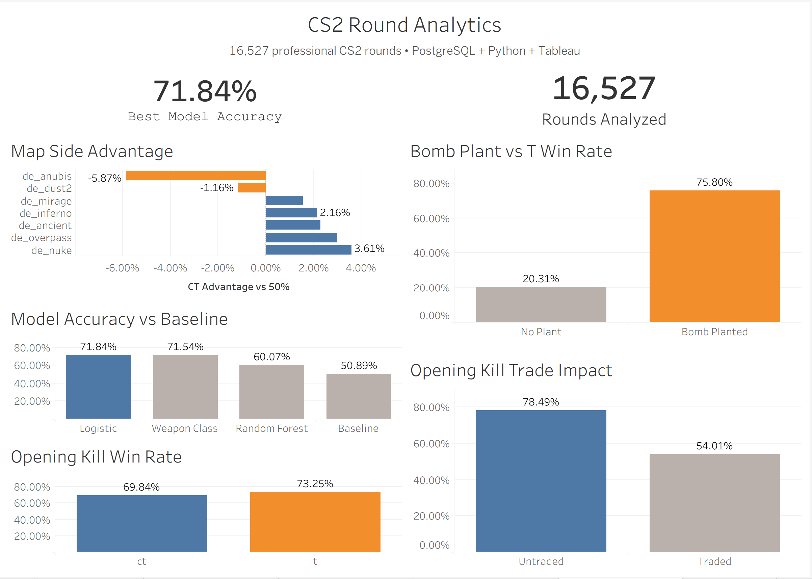

# CS2 Round Analytics

A data analytics project analyzing professional Counter-Strike 2 rounds using PostgreSQL, SQL, Python, pandas, scikit-learn, and Tableau.



[View Interactive Tableau Dashboard](https://public.tableau.com/app/profile/nicholas.hinkel/viz/CS2-Analytics/CS2RoundAnalytics?publish=yes)

## Project Overview

This project analyzes 16,527 professional CS2 rounds to identify factors associated with round outcomes and build a machine learning model to predict whether CT or T wins.

## Tech Stack

- PostgreSQL
- SQL
- Python
- pandas
- scikit-learn
- Tableau
- Git / GitHub

## Database

Built a relational PostgreSQL database containing:

- 794 match/map records
- 16,527 rounds
- 111,715 kills
- 168,294 player-round records

Tables:

- `matches`
- `rounds`
- `kills`
- `round_player`

## Key Findings

- The side getting the opening kill won roughly 70–73% of rounds.
- An untraded opening kill resulted in a 78.5% round win rate.
- When the opening kill was traded within 5 seconds, that dropped to about 54%.
- T-side win rate increased from 20.3% without a bomb plant to 75.8% with a plant.
- Map side advantage varied, with Anubis leaning T and Nuke leaning CT.

## Machine Learning

Built models using:

- Map
- Opening kill side
- Opening kill timing
- Opening weapon / weapon class

Results:

| Model | Accuracy |
|---|---:|
| Logistic Regression | 71.84% |
| Weapon Class Logistic Regression | 71.54% |
| Random Forest | 60.07% |
| Baseline | 50.89% |

Logistic Regression performed best.

## SQL Optimization

Used `EXPLAIN ANALYZE` and composite indexing to optimize a high-volume kill query.

Execution time improved from:

**12.868 ms → 0.085 ms**

Approximately a **99.3% reduction in execution time**.

## Project Structure

```text
cs2-analytics/
├── data/
├── images/
│   └── dashboard.png
├── python/
│   ├── analysis.py
│   ├── export_tableau.py
│   ├── inspect_data.py
│   └── load_data.py
├── sql/
│   ├── analysis.sql
│   ├── optimization.sql
│   └── schema.sql
├── tableau/
└── README.md

## Data Source

[OpenCS2 Dataset](https://huggingface.co/datasets/blanchon/opencs2_dataset)